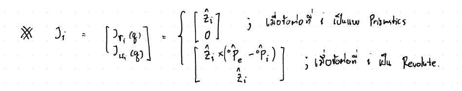

# **FRA333 Homework Assignment 3 : Static Force**
แสดงขั้นตอน แนวคิดของการตรวจคำตอบ และ ผลลัพธ์ของการตรวจสอบ
# Team Members
1. [Thitirat Santichaiyakun 6518](https://github.com/Qzider)
2. [Pongsakorn Chaikaew 6539](https://github.com/pooonggg)
# Robot

โดยจากโจทย์จะมี MDH-Table ดังนี้ 

| a_{j-1} | alpha_{j-1} | theta_j | d_j |
|-------------|------------------|----------------|---------|
| 0.0         | 0.0°             | q1 + 180°      | d_1     |
| 0.0         | 90.0°            | q2             | 0.0     |
| a_2         | 0.0°             | q3             | 0.0     |

ความยาวของแต่ละ Link
| Parameter | Length (m) |
|-----------|------------|
| d_1   | 0.0892     |
| a_2   | -0.425     |
| a_3   | -0.39243   |
| d_4   | 0.109      |
| d_5   | 0.093      |
| d_6   | 0.082      |

สร้าง MDH Parameters โดยใช้ roboticstoolbox
```py
robot = DHRobot([
        RevoluteMDH(alpha=0, a=0, d=d1, offset=pi),
        RevoluteMDH(alpha=pi/2, a=0, d=0, offset=0),
        RevoluteMDH(alpha=0, a=-a2, d=0, offset=0)
    ], name="3DOF_Robot", tool=SE3([
        [0, 0, -1, -(a3 + d6)],
        [0, 1, 0, -d5],
        [1, 0, 0, d4],
        [0, 0, 0, 1]
    ]))
``` 
กำหนดค่า q_init ที่ใช้สำหรับการสร้างมุมของแต่ละข้อต่อ
```py
q_init = [0.0, 0.0, 0.0]  # Initial joint configuration (all joints at 0 position)
``` 

## **คำถามข้อที่ 1**
จงเขียนฟังก์ชั่นในการ Jacobian ของหุ่นยนต์ตัวนี้ให้อยู่ในฟังก์ชั่นต่อไปนี้ J_e = endEffectorJacobianHW3(q)
โดย Function Jacobian คำนวณได้จาก

ซึ่งจากหุ่นในรูปนั้นเป็นแบบ Revolute เราจึงใช้วิธีการคำนวณแบบ Revolute ซึ่งจะเขียนเป็น Function ได้ดังต่อไปนี้
```py
def endEffectorJacobianHW3(q:list[float])->list[float]:
    R,P,R_e,p_e = FKHW3(q)
    n_joints = len(q)
    J = np.zeros((6, n_joints))
    
    for i in range(n_joints):
        p_i = P[:,i]
        z = R[:,2,i] # เอาแค่ Rotation ของ Z มาใช้
        J[:3,i] = (np.cross(z,(p_e - p_i))) @ R_e # linear velocity
        J[3:,i] = z @ R_e# angular velocity
        
    return J
```
### **วิธีการตรวจสอบข้อที่ 1**
ตรวจสอบโดยใช้ MDH Parameters ที่สร้างไว้ข้างต้นและใช้ robot.jacobe ใน robotictoolsbox เทียบกับ endEffectorJacobianHW3
```py
# Calculate Jacobian using custom function and Robotics Toolbox
    J_custom = endEffectorJacobianHW3(q_init)
    J_rtb = robot.jacobe(q_init)
```
### ผลลัพธ์ที่ได้เมื่อเทียบกัน
```py
==================================================
ตรวจคำตอบข้อ 1: เปรียบเทียบ Jacobian
==================================================

Jacobian (คำนวณเอง):
----------------------------------------
  0.8994  -0.0000  -0.0000
 -0.0000  -0.8994  -0.4744
 -0.1090  -0.0930  -0.0930
  0.0000   1.0000   1.0000
  1.0000  -0.0000  -0.0000
 -0.0000   0.0000   0.0000

Jacobian (Robotics Toolbox):
----------------------------------------
  0.8994   0.0000   0.0000
 -0.0000  -0.8994  -0.4744
 -0.1090  -0.0930  -0.0930
  0.0000   1.0000   1.0000
  1.0000   0.0000   0.0000
  0.0000   0.0000   0.0000
```
จากผลลัพธ์ของทั้งสอง Function จะเห็นได้ว่ามีค่า Jacobian Matrix ที่ตรงกัน
## **คำถามข้อที่ 2**
จงเขียนฟังก์ชั่นในการหาสภาวะ Singularity โดยที่ _∣∣det(J(q))∣∣ < ε_ เมื่อให้ค่า _ε_ = 0.001 และ _J*(.)_ คือเมตริกซ์จาโคเบียนที่ถูกลดรูปแล้ว
```py
def checkSingularityHW3(q:list[float])->bool:
    # คำนวณ Jacobian
    J = endEffectorJacobianHW3(q)
    
    # ใช้เฉพาะส่วนของ Jacobian ที่เป็น 3x3 (เชิงเส้น)
    J_reduced = J[:3, :]  # ลดรูป Jacobian สำหรับตรวจหา Singularity

    # คำนวณ determinant ของ Jacobian ที่ลดรูปแล้ว
    det_J = np.linalg.det(J_reduced)
    # คำนวณหาค่า norm จาก det_J
    Norm_J = np.linalg.norm(det_J)

    # ใช้ค่า Norm เพื่อตรวจสอบ Singularity
    if  Norm_J < epsilon:
        return 1  # Singularity
    else:
        return 0  # ปกติ
```
โดยนำค่า Jacobian ที่ได้จากข้อที่ 1 มาทำการลดรูปให้เหลือแค่ในส่วนของ linear velocity เพื่อนำมาคำนวณหา det และทำการหา norm โดยได้ Function np.linalg.det และ np.linalg.norm ตามลำดับ และ check ค่า singularity โดยการกำหนดขอบเขตโดยใช้  _ε_ เป็นตัวกำหนดขอบเขต
### **วิธีการตรวจสอบข้อที่ 2**

## **คำถามข้อที่ 3**
จงเขียนฟังก์ชั่นในการหา effort ของแต่ละข้อต่อเมื่อมี wrench มากระทำกับจุดกึ่งกลางของเฟรมพิกัด Fe
คำนวณหา effort จากสูตร 

$$\tau\ =\ J^T \times w$$

โดยที่กำหนดค่า w_init ที่ดเป็นค่า wrench 
```py
w_init = [0.0, 10.0, 0.0, 0.0, 0.0, 0.0]  # Initial end-effector wrench (force and moment)
```
สร้าง Function tau = computeEffortHW3(q,w)
```py
def computeEffortHW3(q:list[float], w:list[float])->list[float]:
    # Jacobian ของหุ่นยนต์
    J = endEffectorJacobianHW3(q)
    # คำนวณ Jacobian Transpose
    J_T = np.transpose(J)
    # คำนวณค่า torque สำหรับข้อต่อ
    tau = J_T @ w  
    return tau
```
ทำการหา Torque โดยใช้จาก Function ข้อที่ 1 มาทำการ Transpose หลังจากนั้นนำมาคูณกับค่า wrench ที่กำหนดไว้เพื่อหา Torque
### **วิธีการตรวจสอบข้อที่ 3**
